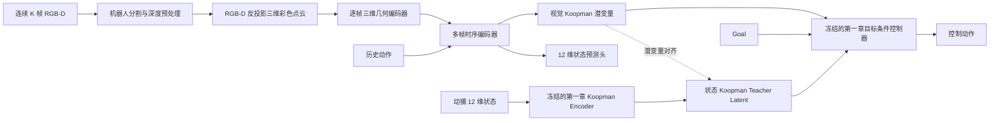
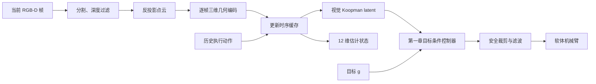

# 基于单 RGB-D 三维几何重构与 Koopman 对齐的软体机械臂视觉状态表征方案

## 1. 研究定位

### 1.1 研究问题

第一章已经建立了基于动捕状态的目标条件强化学习运动控制策略。设软体机械臂的真实状态为：

\[
s_t=
\begin{bmatrix}
p_t & r_t & v_t & \omega_t
\end{bmatrix}^{\top}
\in\mathbb{R}^{12}
\]

其中：

- \(p_t\in\mathbb{R}^{3}\)：TCP 三维位置；
- \(r_t\in\mathbb{R}^{3}\)：TCP 三维姿态参数；
- \(v_t\in\mathbb{R}^{3}\)：TCP 线速度；
- \(\omega_t\in\mathbb{R}^{3}\)：TCP 角速度。

第一章中，状态经状态编码器提升至 Koopman 潜在空间：

\[
z_t^S=E_s(s_t),
\]

并满足近似受控线性演化：

\[
z_{t+1}^S \approx A z_t^S+B u_t.
\]

第一章的目标条件控制器可统一表示为：

\[
u_t=\pi_{\mathrm{GC}}(z_t^S,g_t),
\]

其中 \(g_t\) 是目标状态或目标位置。

第二章需要解决的问题是：

> 在部署阶段不访问动捕状态，仅使用一台固定 RGB-D 相机及历史动作，从多帧视觉观测中恢复与第一章一致的 12 维 TCP 状态及 Koopman 潜在状态，并继续复用第一章的目标条件控制器。

因此，第二章不应被表述为普通的“图像到状态回归”，而应被定义为：

> **基于三维几何重构、时序状态估计和特权 Koopman 对齐的控制感知视觉状态表征学习。**

---

## 2. 与 Li et al. 的关系

参考论文：

> Li, S. L., Zhang, A., Chen, B., et al. *Controlling diverse robots by inferring Jacobian fields with deep networks*. Nature, 2025.

### 2.1 原文使用的三维重构算法

原文的三维感知模块采用了 **pixelNeRF 风格的单视图条件神经辐射场**。

pixelNeRF 的核心思想是：

1. 对输入 RGB 图像进行二维卷积特征提取，获得特征图；
2. 对任意三维查询点 \(x\in\mathbb{R}^{3}\)，利用已知相机参数将其投影到输入图像平面；
3. 在二维特征图的投影位置进行双线性采样；
4. 将采样得到的图像特征与三维位置编码拼接；
5. 通过 MLP 预测该三维点的颜色和体密度；
6. 通过可微体渲染得到目标视角的 RGB 与深度图，并使用重构误差训练三维神经场。

形式上，对于三维查询点 \(x\)：

\[
q=\Pi(x;K,T),
\]

其中 \(K\) 和 \(T\) 分别为相机内参和外参。随后从图像特征图 \(F_t\) 中采样：

\[
f_t(x)=\operatorname{BilinearSample}(F_t,q).
\]

神经场网络输出：

\[
(c_t(x),\sigma_t(x))
=
G_{\mathrm{field}}
\left(
f_t(x),\gamma(x)
\right),
\]

其中：

- \(c_t(x)\)：三维点颜色；
- \(\sigma_t(x)\)：体密度；
- \(\gamma(x)\)：三维坐标的正余弦位置编码。

原文在训练时使用 **12 台标定的 RGB-D 相机**。每次训练随机选择一个源视角作为单视图输入，再选择另一个目标视角，通过体渲染生成目标视角的 RGB 和深度，与真实 RGB-D 观测比较。部署时只需一台相机。

因此需要区分：

- **推理阶段是单相机输入；**
- **原文训练阶段并不是仅有一台相机，而是使用多视角 RGB-D 监督训练单视图到三维的先验。**

### 2.2 本研究借鉴的部分

本研究只保留其核心思想：

> 不直接从二维图像回归 TCP 状态，而是先构造具有明确几何意义的三维机器人表征，再从三维表征中提取控制状态。

本研究不保留 Jacobian Field，不再学习：

\[
\Delta x=J(x,I)\Delta u.
\]

动力学与控制能力仍由第一章的 Koopman 空间和目标条件强化学习控制器提供。

因此两部分职责为：

\[
\text{RGB-D 三维重构：描述当前三维构型}
\]

\[
\text{Koopman 模型：描述状态在动作作用下如何演化}
\]

\[
\text{目标条件策略：根据当前状态和目标生成控制动作}
\]

---

## 3. 单 RGB-D 条件下的总体方案

由于当前只有一台 RGB-D 相机，直接照搬原文的 pixelNeRF 跨视角训练并不合适。更稳妥的方案是：

1. 使用 RGB-D 深度将每一帧直接反投影为世界坐标系下的三维彩色点云；
2. 使用三维点云编码器提取当前帧的几何特征；
3. 可选地加入点云或隐式占据场重构任务，使三维特征保留完整几何信息；
4. 使用连续多帧三维几何特征和历史动作估计 TCP 位姿与速度；
5. 将视觉潜变量对齐到第一章固定的 Koopman 潜在空间；
6. 通过 Koopman 演化约束和控制输出一致性约束保证视觉表征可用于控制；
7. 部署时完全移除动捕输入，使用视觉估计状态驱动第一章控制器。

总体流程为：



---

## 4. 数据定义与同步采集

### 4.1 每个时间步的数据

建议同步记录：

\[
\mathcal D_t=
\{
I_t,\,
D_t,\,
s_t^{\mathrm{mocap}},\,
u_t,\,
g_t,\,
\tau_t
\},
\]

其中：

- \(I_t\)：RGB 图像；
- \(D_t\)：与 RGB 对齐的深度图；
- \(s_t^{\mathrm{mocap}}\in\mathbb R^{12}\)：动捕提供的 TCP 位姿和速度；
- \(u_t\)：实际发送给软体机械臂的控制量；
- \(g_t\)：第一章目标条件控制器使用的目标；
- \(\tau_t\)：时间戳。

如设备能够提供，还建议保存：

- 实际驱动压力、拉索长度或电机位置；
- 阀门反馈；
- 控制命令发送时间和执行时间；
- 动捕原始位姿；
- RGB-D 相机硬件时间戳。

这些量可以帮助排查传感延迟，但不一定全部作为网络输入。

### 4.2 时间同步

视觉速度估计对时间同步非常敏感。需要尽量保证：

\[
| \tau_t^{\mathrm{RGBD}}-\tau_t^{\mathrm{mocap}} | < \epsilon.
\]

建议流程：

1. RGB、深度、动捕和控制动作全部记录时间戳；
2. 以 RGB-D 帧时间为基准；
3. 对动捕位姿进行时间插值；
4. 动作采用最近一次已实际执行的命令；
5. 明确动作与状态转移的时序关系：

\[
(s_t,u_t,s_{t+1})
\]

而不是误配为：

\[
(s_t,u_{t+1},s_{t+1}).
\]

如果系统存在固定控制延迟 \(\delta\)，需要离线估计并对齐：

\[
s_{t+1}\approx f(s_t,u_{t-\delta}).
\]

### 4.3 训练序列

为了估计速度，训练样本不能只是单帧，而应构造成：

\[
\mathcal O_t=
\{
(I_{t-K+1:t},D_{t-K+1:t}),
u_{t-K+1:t-1}
\}.
\]

建议初始设置：

- 相机频率：与控制频率尽量一致；
- 历史长度：\(K=4\sim 8\)；
- 历史时间跨度：覆盖约 \(0.2\sim 0.8\) 秒；
- 序列滑窗步长：1；
- 同一条轨迹内采样，不跨越 reset 边界。

\(K\) 不宜只根据帧数决定，应确保时间窗口能够覆盖软体机械臂明显的运动趋势和迟滞变化。

### 4.4 数据覆盖范围

建议数据由两部分组成。

#### A. 探索性激励数据

通过安全范围内的随机动作或平滑随机动作覆盖：

- 不同初始构型；
- 不同动作方向；
- 不同动作幅值；
- 加载和卸载过程；
- 不同运动速度；
- 同一 TCP 附近的不同历史路径。

这部分数据主要用于学习视觉三维构型和动态状态。

#### B. 第一章策略 rollout 数据

运行第一章基于动捕状态的目标条件控制器，随机设置不同目标：

\[
g\sim p(g),
\]

同步采集完整闭环轨迹。

这部分数据主要用于：

- 状态估计；
- Koopman latent 对齐；
- 策略输出一致性；
- 后续真实闭环部署。

---

## 5. 相机标定与坐标系统一

### 5.1 相机内参

需要获得 RGB-D 相机内参：

\[
K=
\begin{bmatrix}
f_x&0&c_x\\
0&f_y&c_y\\
0&0&1
\end{bmatrix}.
\]

需要确认：

- RGB 与深度是否已经对齐；
- 深度单位是米还是毫米；
- 是否存在畸变；
- 相机 SDK 是否已经进行畸变校正。

### 5.2 相机外参

需要标定从相机坐标系到动捕世界坐标系或机器人基坐标系的变换：

\[
{}^WT_C=
\begin{bmatrix}
{}^WR_C & {}^Wt_C\\
0&1
\end{bmatrix}.
\]

所有三维点和 TCP 状态最终应统一到同一个世界坐标系中。

对于深度像素 \((u,v,d)\)，相机坐标系下的三维点为：

\[
x_C=\frac{(u-c_x)d}{f_x},
\]

\[
y_C=\frac{(v-c_y)d}{f_y},
\]

\[
z_C=d.
\]

转换至世界坐标系：

\[
\begin{bmatrix}
x_W\\1
\end{bmatrix}
=
{}^WT_C
\begin{bmatrix}
x_C\\1
\end{bmatrix}.
\]

### 5.3 坐标归一化

为了提高训练稳定性，可以选择固定工作空间中心 \(c\) 和尺度 \(l\)：

\[
\bar x=\frac{x-c}{l}.
\]

必须保存归一化参数，在训练、验证和部署时完全一致。

---

## 6. RGB-D 预处理与三维重构

### 6.1 机器人区域分割

输入 RGB-D 中通常包含大量背景。建议先获得机器人 mask：

\[
M_t\in\{0,1\}^{H\times W}.
\]

可选方法：

1. 固定背景差分；
2. 基于颜色或深度范围的阈值分割；
3. 少量人工标注后训练轻量分割网络；
4. 使用通用分割模型生成初始 mask，再人工检查；
5. 利用工作空间几何范围裁剪背景。

对于固定相机和固定实验平台，背景差分加深度范围过滤通常已经足够稳定。

### 6.2 深度预处理

建议执行：

- 无效深度过滤；
- 深度范围裁剪；
- 中值滤波或双边滤波；
- 小型孤立点剔除；
- 统计离群点过滤；
- 与 RGB 对齐；
- 机器人 mask 过滤。

得到：

\[
\tilde D_t=M_t\odot D_t.
\]

### 6.3 反投影为彩色点云

将机器人区域内的有效 RGB-D 像素反投影为：

\[
P_t=
\{
(x_i^W,y_i^W,z_i^W,r_i,g_i,b_i)
\}_{i=1}^{N_t}.
\]

再进行：

- 体素下采样；
- 最远点采样；
- 随机采样；
- 固定数量补点或截断。

最终每帧保持固定点数：

\[
P_t\in\mathbb R^{N\times 6}.
\]

建议从 \(N=1024\) 或 \(2048\) 开始。

### 6.4 “三维重构”的定义

在本方案中，三维重构不只是将深度转换成点云，而是要求编码器学习一个能恢复机器人三维几何的中间表示。

定义逐帧几何编码器：

\[
h_t^{\mathrm{geo}}=E_{\mathrm{3D}}(P_t).
\]

再使用几何解码器：

\[
\hat P_t=D_{\mathrm{3D}}(h_t^{\mathrm{geo}}),
\]

或预测深度与 mask：

\[
(\hat D_t,\hat M_t)=D_{\mathrm{render}}(h_t^{\mathrm{geo}},K,T).
\]

这样可以避免三维编码器只提取对状态回归有用的捷径特征，而忽略机器人整体构型。

---

## 7. 推荐的三维几何编码实现

### 7.1 主推荐：RGB-D 点云编码器

对于当前只有一台 RGB-D 的条件，最推荐：

\[
P_t \rightarrow \text{PointNet++ / Point Transformer}
\rightarrow h_t^{\mathrm{geo}}.
\]

PointNet++ 的优点是：

- 实现成熟；
- 数据量要求相对可控；
- 能提取局部和全局几何特征；
- 对非均匀点云有较好的适应能力。

单帧输出：

\[
h_t^{\mathrm{geo}}\in\mathbb R^{d_g}.
\]

可选设置：

- \(d_g=256\) 或 \(512\)；
- 输入使用 XYZ+RGB；
- 消融实验可比较 XYZ 与 XYZ+RGB；
- 位置特征必须统一到世界坐标系。

### 7.2 点云重构损失

可以使用 Chamfer Distance：

\[
\mathcal L_{\mathrm{CD}}
=
\frac{1}{|\hat P_t|}
\sum_{\hat p\in\hat P_t}
\min_{p\in P_t}
\|\hat p-p\|_2^2
+
\frac{1}{|P_t|}
\sum_{p\in P_t}
\min_{\hat p\in\hat P_t}
\|p-\hat p\|_2^2.
\]

也可以使用深度重构：

\[
\mathcal L_{\mathrm{depth}}
=
\frac{
\sum_{u,v}M_t(u,v)
\rho(\hat D_t(u,v)-D_t(u,v))
}{
\sum_{u,v}M_t(u,v)+\epsilon
},
\]

其中 \(\rho\) 可选 Smooth L1。

如果只想保留较轻量的几何约束，可以使用：

\[
\mathcal L_{\mathrm{geo}}
=
\lambda_{\mathrm{CD}}\mathcal L_{\mathrm{CD}}
+
\lambda_{\mathrm{depth}}\mathcal L_{\mathrm{depth}}.
\]

### 7.3 可选增强：pixel-aligned 隐式三维场

为了更接近 Li et al. 的 pixelNeRF 思路，可以增加一个可选隐式场分支。

首先从 RGB-D 图像提取二维特征图：

\[
F_t=E_{\mathrm{2D}}(I_t,D_t).
\]

对于任意三维查询点 \(x\)，投影到图像：

\[
q=\Pi(x;K,T).
\]

采样像素特征：

\[
f_t(x)=\operatorname{BilinearSample}(F_t,q).
\]

由于当前有深度，还可以加入查询点与观测表面的深度残差：

\[
\Delta d(x)=z_C(x)-D_t(q).
\]

隐式场预测：

\[
(o_t(x),c_t(x),\phi_t(x))
=
G_{\mathrm{implicit}}
\left[
f_t(x),
\gamma(x),
\Delta d(x)
\right],
\]

其中：

- \(o_t(x)\)：占据概率或 SDF；
- \(c_t(x)\)：颜色；
- \(\phi_t(x)\)：三维局部特征。

使用 RGB-D 射线可以直接构造：

- 表面点；
- 表面前方自由空间点；
- 表面附近正负扰动点。

从而监督 occupancy 或 SDF。

该分支的优点是具有连续三维表达；缺点是训练和推理成本明显高于点云编码。建议将其作为增强方案，而不是第一版必做项。

### 7.4 为什么不直接照搬 pixelNeRF

原始 pixelNeRF 和 Li et al. 的训练依赖多视角目标图像，用于验证从源图像推断出的三维场能否渲染到其他视角。

只有一台固定相机时，同一时刻没有其他视角真值，因此：

- 无法提供严格的跨视角 RGB 重构监督；
- 遮挡区域和背面几何缺少直接约束；
- 单视图神经场可能依赖类别先验“猜测”不可见部分。

RGB-D 已经给出了可见表面的三维坐标，因此当前阶段直接点云编码更可靠。

---

## 8. 多帧时序状态提取

### 8.1 为什么必须使用多帧

单帧 RGB-D 可以观察 TCP 的当前几何位置和姿态，但不能稳定判断：

- 当前朝哪个方向运动；
- 线速度和角速度；
- 正在加载还是卸载；
- 是否处于回弹过程；
- 相同构型下的不同迟滞分支。

因此使用：

\[
\{
h_{t-K+1}^{\mathrm{geo}},
\ldots,
h_t^{\mathrm{geo}}
\}
\]

以及历史动作：

\[
\{
u_{t-K+1},
\ldots,
u_{t-1}
\}
\]

估计动态状态。

### 8.2 时序输入

先将每一帧几何特征与对应动作嵌入拼接：

\[
e_i=
\left[
h_i^{\mathrm{geo}},
E_u(u_{i-1}),
\Delta\tau_i
\right].
\]

其中 \(E_u\) 是动作编码器，\(\Delta\tau_i\) 是时间间隔。

时序编码：

\[
h_t^{\mathrm{temp}}
=
E_{\mathrm{temp}}(e_{t-K+1:t}).
\]

### 8.3 时序网络选择

#### 第一版推荐：GRU

\[
h_i^{\mathrm{temp}}
=
\operatorname{GRU}
(e_i,h_{i-1}^{\mathrm{temp}}).
\]

优点：

- 数据量要求较低；
- 容易训练；
- 适合在线递推；
- 推理延迟较小。

#### 数据充分后的增强：Temporal Transformer

优势是：

- 能显式建模不同历史时刻的重要性；
- 更容易处理不等间隔和较长历史；
- 可加入 attention mask。

但对数据规模和正则化要求更高。

### 8.4 双输出头

时序特征分别进入：

#### 12 维状态预测头

\[
\hat s_t=D_s(h_t^{\mathrm{temp}})\in\mathbb R^{12}.
\]

#### 视觉 Koopman 潜变量头

\[
z_t^V=P_z(h_t^{\mathrm{temp}})\in\mathbb R^{d_z}.
\]

其中 \(d_z\) 必须与第一章状态 Koopman latent 的维度完全一致。

这里不建议直接令：

\[
z_t^V=E_s(\hat s_t),
\]

作为唯一视觉 latent，因为这会导致视觉分支只能利用 12 维显式状态，无法保留多帧视觉中额外的动态信息。

更合理的是：

- 通过 \(\hat s_t\) 保证显式状态可解释性；
- 通过 \(z_t^V\) 直接对齐第一章 Koopman 空间；
- 两个输出共享三维和时序 backbone。

---

## 9. 特权状态教师路径

第一章的状态 Koopman 编码器保持冻结：

\[
z_t^S=E_s(s_t^{\mathrm{mocap}}).
\]

这里上标 \(S\) 表示 state teacher，上标 \(V\) 表示 visual student。

训练第二章时使用 stop-gradient：

\[
\operatorname{sg}(z_t^S),
\]

即将第一章的 Koopman latent 作为固定监督目标，不允许第二章的 loss 反向修改第一章的状态空间。

PyTorch 对应：

```python
with torch.no_grad():
    z_state = state_koopman_encoder(mocap_state)

z_visual = visual_temporal_encoder(images, depth, action_history)
loss_align = torch.mean((z_visual - z_state) ** 2)
```

---

## 10. 损失函数设计

第二章核心损失为：

\[
\mathcal L=
\lambda_{\mathrm{geo}}\mathcal L_{\mathrm{geo}}
+
\lambda_s\mathcal L_{\mathrm{state}}
+
\lambda_a\mathcal L_{\mathrm{align}}
+
\lambda_k\mathcal L_{\mathrm{koop}}
+
\lambda_\pi\mathcal L_{\mathrm{control}}.
\]

不再额外设置普通的 \(L_{\mathrm{dyn}}\)，因为 \(L_{\mathrm{align}}\) 与 \(L_{\mathrm{koop}}\) 已经对视觉潜变量施加了预测性约束。

### 10.1 三维几何重构损失

采用点云重构时：

\[
\mathcal L_{\mathrm{geo}}=\mathcal L_{\mathrm{CD}}.
\]

采用深度重构时：

\[
\mathcal L_{\mathrm{geo}}
=
\lambda_d\mathcal L_{\mathrm{depth}}
+
\lambda_m\mathcal L_{\mathrm{mask}}.
\]

如果二者都使用：

\[
\mathcal L_{\mathrm{geo}}
=
\lambda_{\mathrm{CD}}\mathcal L_{\mathrm{CD}}
+
\lambda_d\mathcal L_{\mathrm{depth}}
+
\lambda_m\mathcal L_{\mathrm{mask}}.
\]

### 10.2 12 维状态监督

由于位置、姿态、线速度和角速度量纲不同，不建议直接把 12 维全部放入一个未经归一化的 MSE。

定义：

\[
\mathcal L_{\mathrm{state}}
=
\lambda_p\mathcal L_p+
\lambda_r\mathcal L_r+
\lambda_v\mathcal L_v+
\lambda_\omega\mathcal L_\omega.
\]

位置损失：

\[
\mathcal L_p
=
\|\hat p_t-p_t\|_2^2.
\]

姿态损失：

若第一章使用欧拉角或旋转向量，可对角度进行周期处理；若内部允许转换为旋转矩阵，优先使用旋转测地距离：

\[
\mathcal L_r
=
\left[
\cos^{-1}
\left(
\frac{
\operatorname{tr}
(\hat R_t^\top R_t)-1
}{2}
\right)
\right]^2.
\]

线速度损失：

\[
\mathcal L_v
=
\|\hat v_t-v_t\|_2^2.
\]

角速度损失：

\[
\mathcal L_\omega
=
\|\hat\omega_t-\omega_t\|_2^2.
\]

工程实现时，也可以先对 12 个维度分别标准化：

\[
\bar s_j=\frac{s_j-\mu_j}{\sigma_j},
\]

再使用 Smooth L1 或 MSE。

### 10.3 Koopman 潜变量对齐

\[
\mathcal L_{\mathrm{align}}
=
\left\|
z_t^V-
\operatorname{sg}
\left[
E_s(s_t^{\mathrm{mocap}})
\right]
\right\|_2^2.
\]

该项保证视觉潜变量落入第一章已经学习好的 Koopman 状态流形。

### 10.4 Koopman 受控演化约束

使用第一章固定的 \(A,B\)：

\[
\hat z_{t+1}^{V,\mathrm{koop}}
=
A z_t^V+B u_t.
\]

损失为：

\[
\mathcal L_{\mathrm{koop}}
=
\left\|
z_{t+1}^V-
(Az_t^V+Bu_t)
\right\|_2^2.
\]

也可以使用多步形式：

\[
\hat z_{t+h}^{V}
=
A^h z_t^V+
\sum_{j=0}^{h-1}
A^{h-1-j}Bu_{t+j},
\]

\[
\mathcal L_{\mathrm{koop}}^{H}
=
\sum_{h=1}^{H}
\alpha_h
\left\|
z_{t+h}^{V}
-
\hat z_{t+h}^{V}
\right\|_2^2.
\]

如果第一章的 Koopman 模型在多步预测中已经比较稳定，可以使用 \(H=2\sim5\)。如果多步累积误差明显，则先使用单步。

### 10.5 控制输出一致性

状态教师动作：

\[
u_t^S
=
\pi_{\mathrm{GC}}
\left(
z_t^S,g_t
\right).
\]

视觉学生动作：

\[
u_t^V
=
\pi_{\mathrm{GC}}
\left(
z_t^V,g_t
\right).
\]

使用同一个冻结控制器时：

\[
\mathcal L_{\mathrm{control}}
=
\left\|
u_t^V-
\operatorname{sg}(u_t^S)
\right\|_2^2.
\]

该项的含义不是再次做行为克隆，而是保证视觉 latent 的误差不会改变第一章控制器的决策。

如果动作各维量纲不同，需要先按动作范围归一化。

### 10.6 为什么不单独加入普通动力学预测损失

普通动力学损失通常写为：

\[
\mathcal L_{\mathrm{dyn}}
=
\|\hat s_{t+1}-s_{t+1}\|^2.
\]

本方案中：

1. \(L_{\mathrm{align}}\) 让每个时刻的视觉 latent 对齐真实状态对应的 Koopman latent；
2. \(L_{\mathrm{koop}}\) 直接约束视觉 latent 在动作作用下的下一步演化；
3. 第一章 Koopman decoder 或状态头已经提供从 latent 到状态的映射；
4. \(L_{\mathrm{control}}\) 进一步约束 latent 的控制等价性。

因此独立的 \(L_{\mathrm{dyn}}\) 与现有损失功能重叠，可以不作为主损失。可在消融实验中加入，用于检验其是否带来额外收益。

---

## 11. 推荐训练阶段

### 阶段 0：固定第一章模块

冻结：

- 状态 Koopman encoder \(E_s\)；
- Koopman 矩阵 \(A,B\)；
- 第一章目标条件控制器 \(\pi_{\mathrm{GC}}\)；
- 如有 Koopman decoder，也先冻结。

确认第一章 checkpoint 在第二章数据上仍能正确处理动捕状态。

### 阶段 1：三维几何预训练

训练：

\[
E_{\mathrm{3D}},D_{\mathrm{3D}}.
\]

损失：

\[
\mathcal L=\mathcal L_{\mathrm{geo}}.
\]

目标是让逐帧编码器稳定提取机器人三维构型，而不是立即优化控制。

### 阶段 2：多帧 12 维状态估计

加入时序编码器和状态头：

\[
\mathcal L=
\lambda_{\mathrm{geo}}\mathcal L_{\mathrm{geo}}
+
\lambda_s\mathcal L_{\mathrm{state}}.
\]

首先验证：

- TCP 位置是否准确；
- 姿态是否稳定；
- 速度是否明显优于单帧模型；
- 多帧长度 \(K\) 是否合适。

### 阶段 3：Koopman latent 蒸馏

加入：

\[
\mathcal L_{\mathrm{align}}
+
\mathcal L_{\mathrm{koop}}.
\]

此时视觉状态开始与第一章动力学空间绑定。

### 阶段 4：控制一致性训练

加入：

\[
\mathcal L_{\mathrm{control}}.
\]

建议先使用较小权重，避免模型为了匹配动作而牺牲状态精度。

### 阶段 5：联合微调

使用完整损失：

\[
\mathcal L=
\lambda_{\mathrm{geo}}\mathcal L_{\mathrm{geo}}
+
\lambda_s\mathcal L_{\mathrm{state}}
+
\lambda_a\mathcal L_{\mathrm{align}}
+
\lambda_k\mathcal L_{\mathrm{koop}}
+
\lambda_\pi\mathcal L_{\mathrm{control}}.
\]

建议采用分组学习率：

- 三维 backbone：较小学习率；
- 时序模块：中等学习率；
- 输出头：较大学习率；
- 第一章所有模块：冻结。

---

## 12. 推理与闭环控制流程

部署阶段不使用动捕。

维护长度为 \(K\) 的滑动窗口：

\[
\mathcal B_t=
\{
(I_{t-K+1:t},D_{t-K+1:t}),
u_{t-K+1:t-1}
\}.
\]

推理过程：



控制输出：

\[
u_t=
\pi_{\mathrm{GC}}(z_t^V,g_t).
\]

建议增加：

- 动作范围裁剪；
- 单步变化率限制；
- 低通滤波；
- 状态置信度检测；
- 深度严重缺失时保持上一动作或进入安全状态。

---

## 13. 单 RGB-D 是否可行

### 13.1 可行条件

单 RGB-D 优先可行，需要满足：

1. 相机为固定 eye-to-hand 视角；
2. 软体机械臂主要运动区域均在视野内；
3. TCP 和大部分臂体在多数时刻可见；
4. 深度对软体材料表面有效；
5. 背景和机器人能够稳定分割；
6. 相机坐标到动捕世界坐标的外参准确；
7. 操作物体不会长期完全遮挡软臂。

RGB-D 相比纯 RGB 的优势是：

- 每帧直接获得可见表面的三维坐标；
- 不需要仅依靠单目尺度推断；
- 位置监督与动捕状态天然在三维空间中对齐；
- 点云编码比单视图 NeRF 更适合当前硬件条件。

### 13.2 单相机的局限

单 RGB-D 仍然存在：

- 背面不可见；
- 自遮挡；
- 末端被物体遮挡；
- 软体材料反光造成深度缺失；
- 某些姿态在单视角下存在旋转歧义；
- 可见点云随视角发生拓扑变化。

时序网络能够部分缓解短时遮挡，但无法恢复长期完全不可见的信息。

### 13.3 何时考虑第二台 RGB-D

先完成单相机基线。出现以下情况时，再增加第二台：

- TCP 经常被软臂或物体遮挡；
- 角度误差远大于位置误差；
- 深度有效点比例长期过低；
- 某些工作空间区域控制成功率显著下降；
- 单相机 visual-state 与 mocap-state 的性能差距无法通过时序模型缩小。

双相机扩展方式：

\[
P_t=
P_t^{(1)}
\cup
{}^WT_{C_2}P_t^{(2)}.
\]

两路点云统一变换到世界坐标系后融合，再进入同一个三维编码器。后续时序、Koopman 和控制部分无需改变。

---

## 14. 网络结构建议

### 14.1 可实现的第一版配置

```yaml
input:
  camera_count: 1
  modality: RGB-D
  point_features: [x, y, z, r, g, b]
  points_per_frame: 2048
  history_length: 6

geometry_encoder:
  type: PointNet++
  output_dim: 256

geometry_decoder:
  type: point_cloud_decoder
  reconstructed_points: 1024

action_encoder:
  type: MLP
  output_dim: 64

temporal_encoder:
  type: GRU
  hidden_dim: 256
  num_layers: 2

state_head:
  output_dim: 12

koopman_head:
  output_dim: same_as_chapter1_latent

frozen_modules:
  - chapter1_state_encoder
  - chapter1_koopman_A
  - chapter1_koopman_B
  - chapter1_goal_conditioned_controller
```

### 14.2 前向过程伪代码

```python
def visual_state_forward(
    rgb_seq,
    depth_seq,
    action_history,
    camera_intrinsics,
    camera_extrinsics,
):
    frame_features = []

    for rgb, depth in zip(rgb_seq, depth_seq):
        robot_mask = segment_robot(rgb, depth)
        point_cloud = backproject_rgbd(
            rgb=rgb,
            depth=depth,
            mask=robot_mask,
            intrinsics=camera_intrinsics,
            extrinsics=camera_extrinsics,
        )
        point_cloud = preprocess_and_sample(point_cloud)
        geo_feature = geometry_encoder(point_cloud)
        frame_features.append(geo_feature)

    action_features = action_encoder(action_history)
    temporal_feature = temporal_encoder(
        frame_features,
        action_features,
    )

    estimated_state = state_head(temporal_feature)
    visual_koopman_latent = koopman_head(temporal_feature)

    return estimated_state, visual_koopman_latent
```

### 14.3 训练损失伪代码

```python
estimated_state, z_visual = visual_state_forward(
    rgb_seq,
    depth_seq,
    action_history,
    intrinsics,
    extrinsics,
)

with torch.no_grad():
    z_state = chapter1_state_encoder(mocap_state)
    z_state_next = chapter1_state_encoder(mocap_state_next)

loss_state = state_loss(
    estimated_state,
    mocap_state,
)

loss_align = mse_loss(
    z_visual,
    z_state,
)

z_visual_next = visual_state_forward(
    next_rgb_seq,
    next_depth_seq,
    next_action_history,
    intrinsics,
    extrinsics,
)[1]

z_next_pred = A @ z_visual + B @ action_t

loss_koop = mse_loss(
    z_visual_next,
    z_next_pred,
)

with torch.no_grad():
    action_teacher = controller(z_state, goal)

action_visual = controller(z_visual, goal)

loss_control = mse_loss(
    action_visual,
    action_teacher,
)

loss = (
    lambda_geo * loss_geo
    + lambda_state * loss_state
    + lambda_align * loss_align
    + lambda_koop * loss_koop
    + lambda_control * loss_control
)
```

---

## 15. 实验设计

### 15.1 状态估计基线

建议至少比较：

1. **单帧 RGB + CNN + MLP**
2. **单帧 RGB-D 四通道 + CNN + MLP**
3. **单帧 RGB-D 点云 + PointNet++**
4. **多帧 RGB-D 点云 + GRU**
5. **多帧 RGB-D + \(L_{\mathrm{state}}+L_{\mathrm{align}}\)**
6. **多帧 RGB-D + \(L_{\mathrm{state}}+L_{\mathrm{align}}+L_{\mathrm{koop}}\)**
7. **完整方法：再加入 \(L_{\mathrm{control}}\)**

这样可以清楚回答：

- 三维重构是否优于二维回归；
- 多帧是否能提升速度估计；
- Koopman 对齐是否能提升控制；
- 控制一致性是否能进一步缩小与动捕控制的差距。

### 15.2 状态估计指标

#### 位置

\[
\mathrm{RMSE}_{p}
=
\sqrt{
\frac{1}{N}
\sum_t
\|\hat p_t-p_t\|_2^2
}.
\]

建议单位使用 mm。

#### 姿态

使用平均旋转角误差：

\[
e_R=
\cos^{-1}
\left(
\frac{
\operatorname{tr}
(\hat R^\top R)-1
}{2}
\right).
\]

单位使用 degree。

#### 线速度

\[
\mathrm{RMSE}_{v}.
\]

#### 角速度

\[
\mathrm{RMSE}_{\omega}.
\]

#### Koopman latent

\[
\mathrm{MSE}_{z}
=
\|z_t^V-z_t^S\|_2^2.
\]

#### Koopman rollout

评估 1、3、5 步潜在空间预测误差。

### 15.3 控制指标

比较：

- 动捕状态 + 第一章控制器；
- 视觉估计 12 维状态 + 第一章控制器；
- 视觉 Koopman latent + 第一章控制器。

指标包括：

- 目标到达成功率；
- 最终 TCP 位置误差；
- 最终姿态误差；
- 达到阈值所需时间；
- 轨迹长度；
- 动作平滑度；
- 超调量；
- 视觉控制与动捕控制之间的性能差距。

### 15.4 鲁棒性实验

建议测试：

- 局部视觉遮挡；
- 深度随机缺失；
- 背景变化；
- 光照变化；
- 新初始构型；
- 新目标位置；
- 不同速度区间；
- 不同负载；
- 相机轻微外参扰动。

---

## 16. 消融实验

### 16.1 是否使用 RGB

比较：

- XYZ；
- XYZ+RGB。

判断颜色是否有助于区分软臂不同区域或 TCP。

### 16.2 是否使用多帧

比较：

- \(K=1\)；
- \(K=2\)；
- \(K=4\)；
- \(K=6\)；
- \(K=8\)。

预期：

- 位置对多帧不一定特别敏感；
- 速度和控制性能会明显受益；
- 过长历史可能增加延迟并引入旧信息。

### 16.3 是否输入动作历史

比较：

\[
E_{\mathrm{temp}}(h_{t-K+1:t}^{\mathrm{geo}})
\]

与：

\[
E_{\mathrm{temp}}
(h_{t-K+1:t}^{\mathrm{geo}},u_{t-K+1:t-1}).
\]

软体机械臂存在迟滞时，动作历史通常有助于区分视觉相似但动力学不同的状态。

### 16.4 不同损失

依次加入：

1. \(L_{\mathrm{state}}\)；
2. \(+L_{\mathrm{align}}\)；
3. \(+L_{\mathrm{koop}}\)；
4. \(+L_{\mathrm{control}}\)。

重点观察闭环控制性能，而不只是状态 RMSE。

### 16.5 三维重构约束

比较：

- 无 \(L_{\mathrm{geo}}\)；
- 点云 Chamfer 重构；
- 深度重构；
- 点云与深度联合重构。

---

## 17. 风险与解决方案

### 17.1 深度对软材料失效

现象：

- 深度空洞；
- 边缘飞点；
- 反光区域大面积缺失。

解决：

- 调整相机角度和曝光；
- 在不影响软体特性的前提下使用哑光表面或视觉纹理；
- 时序深度滤波；
- 使用 RGB 特征补偿；
- 必要时增加第二个视角。

### 17.2 TCP 姿态难以从整体点云识别

解决：

- 在 TCP 附近增加轻量视觉标志；
- 对末端区域单独采样；
- 增加局部点云分支；
- 使用全局点云特征与 TCP 局部特征融合。

### 17.3 速度标签噪声

如果动捕速度由位姿差分得到，可能噪声较大。

建议：

- 优先使用动捕系统直接输出并滤波后的速度；
- 或对位姿轨迹使用 Savitzky–Golay / 低通滤波后再求导；
- 不要直接对噪声位姿做一阶差分；
- 记录真实时间间隔。

### 17.4 视觉 latent 能对齐但控制仍差

可能原因：

- Koopman latent 某些维度对动作极敏感；
- \(L_{\mathrm{align}}\) 的普通 MSE 未体现控制敏感方向；
- 时间同步存在偏差；
- 视觉模型在闭环分布上未训练。

解决：

- 加入 \(L_{\mathrm{control}}\)；
- 增加第一章策略 rollout 数据；
- 使用闭环视觉数据再微调；
- 对 latent 各维按 teacher 标准差归一化；
- 检查动作与状态转移对齐。

### 17.5 单相机遮挡严重

先完成单相机方案。如果遮挡成为主要瓶颈，再增加第二台 RGB-D。第二台相机主要修改三维点云融合模块，不需要改变 Koopman 和控制框架。

---

## 18. 第二章创新点表述

可以表述为：

> 针对软体机械臂难以通过内置传感器直接获得完整运动状态、单帧二维图像难以准确表征三维构型及速度信息的问题，提出一种基于 RGB-D 三维几何重构和多帧时序建模的视觉状态表征方法。该方法首先由单 RGB-D 观测恢复世界坐标系下的软体机械臂三维几何表征，再结合历史动作和连续帧特征估计 TCP 位姿与速度。进一步利用训练阶段动捕系统提供的特权状态，将视觉潜变量对齐至第一章建立的 Koopman 潜在空间，并通过受控线性演化约束和目标条件控制输出一致性约束，使视觉表征同时具备状态可解释性、动力学一致性和控制充分性，最终实现无动捕输入条件下对第一章目标条件控制器的复用。

---

## 19. 与整篇论文的关系

三章可以统一为：

### 第一章：基于动捕状态的目标条件强化学习控制

\[
s_t^{\mathrm{mocap}}
\rightarrow
z_t^S
\rightarrow
\pi_{\mathrm{GC}}(z_t^S,g_t).
\]

解决：

> 已知精确状态和数值目标时，如何控制软体机械臂到达目标。

### 第二章：基于 RGB-D 三维几何与 Koopman 对齐的视觉状态表征

\[
I_{t-K+1:t},D_{t-K+1:t},u_{t-K+1:t-1}
\rightarrow
z_t^V,\hat s_t.
\]

解决：

> 在部署时没有动捕状态时，如何从视觉恢复第一章控制器需要的状态表征。

### 第三章：VLA 的 SFT 与强化学习后训练

\[
I_t,l,z_t^V
\rightarrow
g_t
\quad\text{或}\quad
a_{t:t+H}.
\]

解决：

> 如何从视觉和语言任务中生成目标或动作，并通过后训练提升软体机械臂任务执行能力。

整篇论文的主线为：

\[
\boxed{
\text{特权状态下的运动控制}
\rightarrow
\text{无动捕视觉状态恢复}
\rightarrow
\text{视觉语言任务执行}
}
\]

---

## 20. 推荐章节标题

### 偏工程实现

**基于 RGB-D 三维重构与时序建模的软体机械臂视觉状态估计**

### 偏方法创新

**基于三维几何重构与特权 Koopman 对齐的软体机械臂视觉状态表征**

### 偏控制导向

**面向目标条件控制的软体机械臂三维视觉 Koopman 状态学习**

其中最推荐第二个标题。

---

## 21. 推荐最小可行版本

如果需要控制工作量，先完成：

1. 单 RGB-D 机器人分割；
2. RGB-D 反投影彩色点云；
3. PointNet++ 逐帧几何编码；
4. GRU 编码 6 帧历史和动作历史；
5. 12 维 TCP 状态预测；
6. 第一章 Koopman latent 对齐；
7. Koopman 单步演化约束；
8. 第一章控制器动作一致性；
9. 无动捕闭环控制实验。

第一版不必立即实现：

- 完整 pixelNeRF；
- 新视角合成；
- 稠密隐式场；
- 视频生成；
- Jacobian Field；
- 第二套动力学或控制器。

这些内容可根据实验结果再决定是否加入。

---

## 22. 参考文献

1. Li, S. L., Zhang, A., Chen, B., Matusik, H., Liu, C., Rus, D., & Sitzmann, V. (2025). **Controlling diverse robots by inferring Jacobian fields with deep networks**. *Nature, 643*, 89–95.  
   https://doi.org/10.1038/s41586-025-09170-0

2. Yu, A., Ye, V., Tancik, M., & Kanazawa, A. (2021). **pixelNeRF: Neural Radiance Fields from One or Few Images**. *Proceedings of the IEEE/CVF Conference on Computer Vision and Pattern Recognition*, 4578–4587.  
   https://openaccess.thecvf.com/content/CVPR2021/html/Yu_pixelNeRF_Neural_Radiance_Fields_From_One_or_Few_Images_CVPR_2021_paper.html

3. Qi, C. R., Yi, L., Su, H., & Guibas, L. J. (2017). **PointNet++: Deep Hierarchical Feature Learning on Point Sets in a Metric Space**. *Advances in Neural Information Processing Systems, 30*.  
   https://papers.nips.cc/paper/7095-pointnet-deep-hierarchical-feature-learning-on-point-sets-in-a-metric-space

4. Bruder, D., Fu, X., Gillespie, R. B., Remy, C. D., & Vasudevan, R. (2019). **Data-driven control of soft robots using Koopman operator theory**. *IEEE Transactions on Robotics*.  
   可结合第一章已采用的具体 Koopman 文献统一引用。

5. 第一章中采用的状态编码器、Koopman 受控演化模型和目标条件强化学习方法对应文献，应在第二章中作为固定 teacher model 的来源再次引用。
